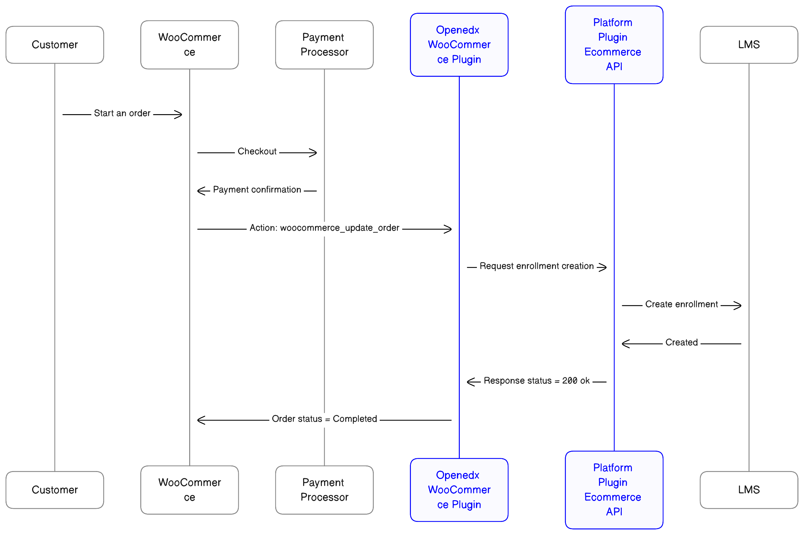

0001 Purpose of This Repo
#########################

Status
******

**Draft**

Context
*******

With the `deprecation of ecommerce`_, Axim launched a funded project to develop capabilities of connecting Open edX to external ecommerce system. The intention is to connect Open edX with a third-party e-commerce platform, enabling a straightforward implementation process and making the e-commerce service accessible for various initiatives. The request for proposal can be found here: `tCRIL Funded Contribution - WooCommerce Discovery`_.

For this integration project, we create a `WooCommerce Discovery document`_, which proposes the creation of a WordPress plugin and an API to generate the necessary actions on the Open edX side. The following image illustrates the expected interactions.

Sequence diagram of purchase using Woocommerce Integration.

Decision
********

* We have created this repository, an installable Django plugin in Open edX, to provide several endpoints related to the necessary operations on the platform to offer the e-commerce service.
* The main objective of this API is to provide endpoints for the fulfillment and refund of enrollments.
* We want the use of the API to be wider than integration with WooCommerce. The idea is to be useful for other integrations with e-commerce services.

Consequences
************

* You need to install this plugin to access its functionalities.

Rejected Alternatives
*********************

* Create this API directly in the core of the platform. (However, depending on its usage, this could change).
* Use the `current enrollment API`_ because user requests only support operations for the current user, and the Server-to-server calls may only deactivate or modify existing enrollments' mode.

References
**********

See `deprecation of ecommerce`_, `tCRIL Funded Contribution - WooCommerce Discovery`_, `WooCommerce Discovery document`_ and `current enrollment API`_ for further information.

.. _`tCRIL Funded Contribution - WooCommerce Discovery`: https://discuss.openedx.org/t/tcril-funded-contribution-woocommerce-discovery/9337
.. _`WooCommerce Discovery document`: https://docs.google.com/document/d/1gImq4DFy3B_JSZlH3tCj5bmPQXji0OCnw1SbGB8bVxw/edit?usp=sharing
.. _`deprecation of ecommerce`: https://discuss.openedx.org/t/deprecation-removal-ecommerce-service-depr-22/6839
.. _`current enrollment API`: https://github.com/openedx/edx-platform/blob/3e35e3af8d895c14f05a55a134dbf8a068cd584a/openedx/core/djangoapps/enrollments/views.py#L446
